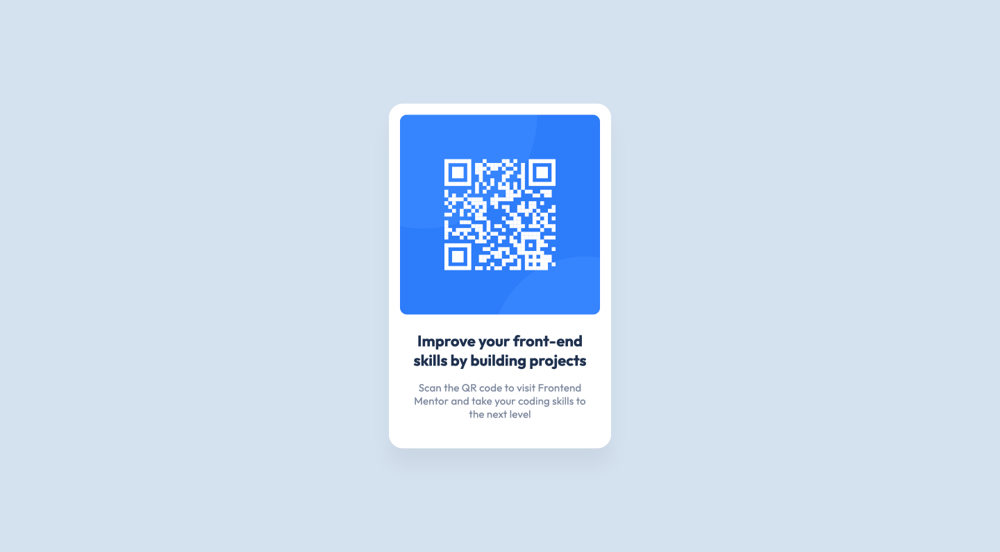

# Frontend Mentor - QR code component solution

This is a solution to the [QR code component challenge on Frontend Mentor](https://www.frontendmentor.io/challenges/qr-code-component-iux_sIO_H). Frontend Mentor challenges help you improve your coding skills by building realistic projects.

## Overview

### Screenshot

### Links

- Solution URL: [GitHub](https://github.com/glebgorokhov/qr)
- Live Site URL: [GitHub Pages](https://glebgorokhov.github.io/qr)

## My process

As this task is extremely simple, I decided to not use any frameworks, and have done it with simple HTML and CSS.

Validations:

- https://jigsaw.w3.org/css-validator/validator?uri=https%3A%2F%2Fglebgorokhov.github.io%2Fqr%2F&profile=css3svg&usermedium=all&warning=1&vextwarning=&lang=en
- https://validator.w3.org/nu/?doc=https%3A%2F%2Fglebgorokhov.github.io%2Fqr%2F
- https://pagespeed.web.dev/report?url=https%3A%2F%2Fglebgorokhov.github.io%2Fqr%2F

## Author

- Frontend Mentor - [@glebgorokhov](https://www.frontendmentor.io/profile/glebgorokhov)
- LinkedIn - https://www.linkedin.com/in/glebgorokhov/
- Upwork - https://www.upwork.com/freelancers/glebgorokhov
- TopTal - https://www.toptal.com/resume/gleb-gorokhov
